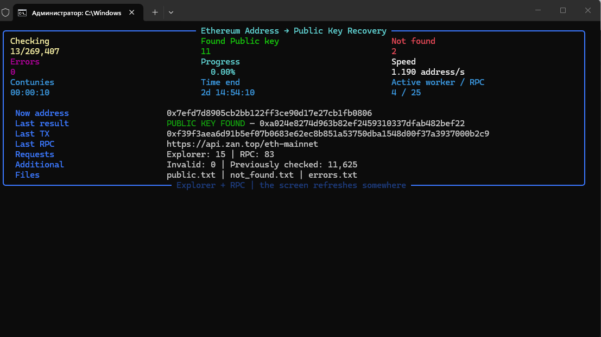
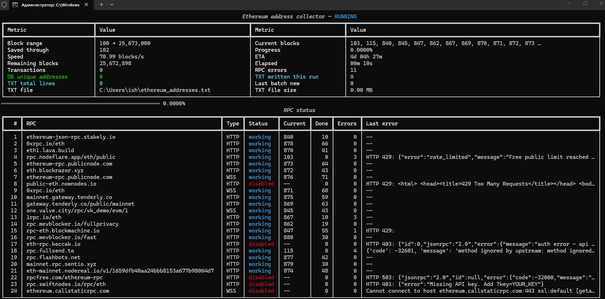
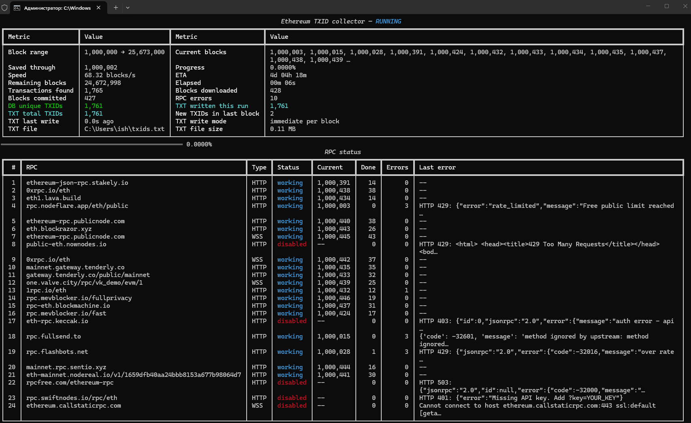

# Ethereum Blockchain Toolkit

A collection of high-performance Python tools for Ethereum blockchain analysis, transaction indexing, address extraction, and ECDSA public key recovery.

These tools are intended for blockchain research, data analysis, interoperability testing, and educational purposes.

---

# Features

- High-performance multi-threaded architecture
- Automatic Ethereum RPC failover
- Automatic retry mechanism
- Resume support
- Beautiful real-time terminal dashboards
- Low memory usage
- Automatic output saving
- Public RPC compatible
- Easy to use

---

# Installation

Clone the repository:

```bash
git clone https://github.com/rijol95-web3/ethereum-tools.git

cd ethereum-tools
```

---

# Repository Structure

```text
.
│
├── images
│   ├── public_key_finder.png
│   ├── addresses_extractor.png
│   └── txid_extractor.png
│
├── scripts
│   ├── ethereum_public_key_finder.py
│   ├── ethereum_addresses_extractor.py
│   └── ethereum_txid_extractor.py
│
├── requirements
│   ├── pub_requirements.txt
│   ├── add_requirements.txt
│   └── tx_requirements.txt
│
├── output
│   ├── addresses.txt
│   ├── public.txt
│   ├── txids.txt
│   ├── not_found.txt
│   └── errors.txt
│
├── all_eth_addresses
│   ├── merge.py
│   └── chunks24mb
│       ├── eth_addresses_0001.txt
│       ├── eth_addresses_0002.txt
│       ├── eth_addresses_0003.txt
│       └── ...
│
├── README.md
└── LICENSE
```

---

# Ethereum Public Key Finder

Recover Ethereum **ECDSA public keys** from Ethereum addresses that have previously signed outgoing transactions.

## Features

- Recover public keys from Ethereum addresses
- Automatic outgoing transaction discovery
- ECDSA public key recovery
- Address verification
- Automatic RPC failover
- Multi-threaded processing
- Live terminal dashboard
- Automatic output saving

## Install

```bash
pip install -r requirements/pub_requirements.txt
```

## Run

```bash
python scripts/ethereum_public_key_finder.py
```

## Preview



## Input

```text
output/addresses.txt
```

## Output

```text
output/public.txt
output/not_found.txt
output/errors.txt
```

---

# Ethereum Addresses Extractor

Extract Ethereum addresses directly from blockchain transactions.

## Features

- High-speed address extraction
- Multi-threaded architecture
- SQLite database support
- Duplicate removal
- Automatic RPC failover
- Resume support
- Live terminal dashboard
- Automatic output saving

## Install

```bash
pip install -r requirements/add_requirements.txt
```

## Run

```bash
python scripts/ethereum_addresses_extractor.py
```

## Preview



## Output

```text
output/addresses.txt
```

---

# Ethereum TXID Extractor

Extract Ethereum transaction hashes (TXIDs) directly from blockchain blocks.

## Features

- High-speed block scanner
- Multi-threaded processing
- SQLite database support
- Automatic RPC switching
- Resume support
- Live terminal dashboard
- Automatic output saving

## Install

```bash
pip install -r requirements/tx_requirements.txt
```

## Run

```bash
python scripts/ethereum_txid_extractor.py
```

## Preview



## Output

```text
output/txids.txt
```

---

# Terminal Dashboard

All tools include a modern live terminal dashboard with real-time statistics.

The dashboard displays:

- Current progress
- Addresses processed
- Transactions processed
- Public keys recovered
- Processing speed
- Elapsed time
- Estimated time remaining (ETA)
- Active workers
- Active RPC endpoints
- Explorer requests
- RPC requests
- Latest processed item
- Current status

The dashboard updates in place without continuously scrolling, keeping the terminal clean and easy to read.

---

# Requirements

- Python 3.10+
- Internet connection
- Public Ethereum RPC endpoints

---

# Output Files

| File | Description |
|------|-------------|
| output/addresses.txt | Extracted Ethereum addresses |
| output/public.txt | Recovered public keys |
| output/txids.txt | Extracted transaction hashes |
| output/not_found.txt | Addresses without recoverable public keys |
| output/errors.txt | Processing errors |

---

# Performance

- Multi-threaded architecture
- Automatic RPC load balancing
- Automatic retry mechanism
- Automatic failover
- Resume support
- Live progress dashboard
- Optimized for large datasets
- Low memory consumption

---

# Disclaimer

This project is intended for blockchain research, education, interoperability testing, and analysis of publicly available blockchain data.

It does **not** recover private keys, bypass cryptographic security, or access non-public information.

---

# License

MIT License

---

<p align="center">

❤️ Crafted with passion by <strong>RiJoL95</strong> for the Ethereum open-source community.

</p>

<p align="center">

If this project helps you, consider leaving a ⭐ on GitHub — every star is greatly appreciated.

</p>

---
